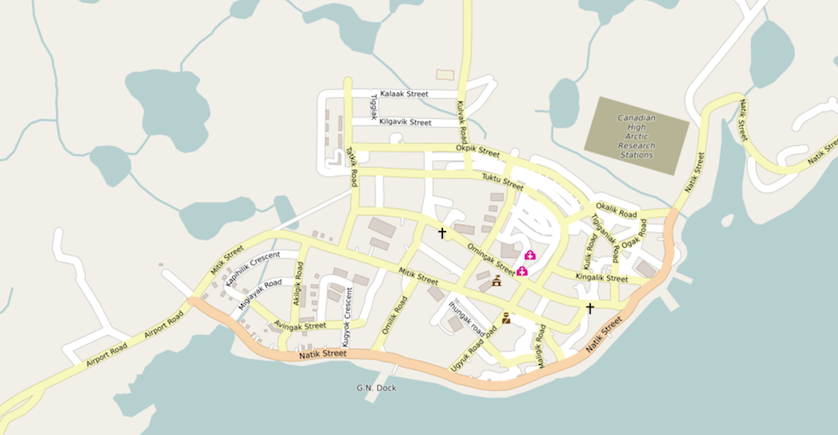

# Arctic Web Map Mapnik Styles

These are [CartoCSS](https://github.com/mapbox/carto) map stylesheets based on the [openstreetmap-carto repository](https://github.com/gravitystorm/openstreetmap-carto). They are used for Arctic Web Map styling.

The currently active commit of this stylesheet used in [Arctic Web Map production](https://webmap.arcticconnect.org) can be seen on the `production` branch.

## Branches

Development from 2015–2017 is on the `stable/1.0` branch. It is kept for reference and is not under active development.

Development from 2019 onwards is on the `master` branch.

| Feature                       | `stable/1.0`           | `master`                    |
|-------------------------------|------------------------|-----------------------------|
| Active Development (2019)     | No                     | Yes                         |
| Coverage                      | Pan-Arctic             | Canada + Alaska + Greenland |
| Projections                   | EPSG:3571 to EPSG:3576 | EPSG:3573 only              |
| Bathymetry Styles             | Yes                    | Yes                         |
| Contour Lines                 | Canada only            | No                          |
| `openstreetmap-carto` Version | v2.45.1                | v4.20.0                     |
| Minutely OSM Updates          | Inactive               | No                          |

## Mac Installation

This will set up [PostgreSQL](https://www.postgresql.org), [PostGIS](http://postgis.net), [osm2pgsql](https://github.com/openstreetmap/osm2pgsql), [GDAL](http://www.gdal.org), [Mapnik](https://github.com/mapnik/mapnik), and [kosmtik](https://github.com/kosmtik/kosmtik) for rendering previews. Some of this information is adapted from James Badger's OSM import notes.

To start, install the prerequisites:

* Ruby 2.3+
* Python
* NodeJS
* Homebrew

Next download the latest style from GitHub:

    $ git clone https://github.com/GeoSensorWebLab/awm-styles
    $ cd awm-styles

Install Postgres using Homebrew. You should be safe to install versions newer than 9.6.

    $ brew install postgresql

You do not need to set up auto-start for Postgresql, as we will set up a separate data directory for Arctic Web Map. Next install GDAL:

    $ brew install osgeo/osgeo4mac/gdal2 --with-complete --with-java --with-opencl --with-postgresql

Then install PostGIS:

    $ brew install postgis

Now set up Postgresql with a data directory somewhere that you have a few GB available for the OpenStreetMap database.

    $ cd ~/Downloads
    $ pg_ctl init -D awm-pg-data

You can edit the Postgresql configuration file to allow for faster imports. See [Paul Norman's "New Server PostgreSQL Tuning"](http://www.paulnorman.ca/blog/2014/11/new-server-postgresql-tuning/) post for some suggestions. For city-level extracts tuning might not be necessary, but for province or country levels you may notice a difference.

If you are running other postgres instances on your machine, edit the port in the configuration. Next start the postgres server.

    $ pg_ctl start -D awm-pg-data

You can stop the server later with:

    $ pg_ctl stop -D awm-pg-data

Next set up the database for OSM.

    $ createuser osm
    $ createdb -E UTF8 -O osm gis
    $ psql -f /usr/local/Cellar/postgis/2.3.2/share/postgis/postgis.sql -d gis
    $ psql -f /usr/local/Cellar/postgis/2.3.2/share/postgis/spatial_ref_sys.sql -d gis
    $ psql -d gis -c "ALTER TABLE geometry_columns OWNER TO osm; ALTER TABLE spatial_ref_sys OWNER TO osm;"
    $ psql -d gis -c "CREATE EXTENSION hstore;"

Now install Mapnik using Homebrew. This can take > 10 minutes to build.

    $ brew install mapnik --with-gdal --with-postgresql

And then install osm2pgsql.

    $ brew install osm2pgsql

Next download an OSM extract for testing. Please don't download the entire planet file, you will be waiting literally days to finish the import. I highly recommend downloading from [GeoFabrik](http://download.geofabrik.de/index.html), specifically Nunavut/North West Territories/Yukon regions. Download the `.osm.pbf` versions as they are the most compressed.

If you want to merge multiple `.osm.pbf` files, you will need osmosis. (Skip this step if you are only using one extract file.) As an example, here is how to merge Nunavut and NWT into one file for import.

    $ brew install osmosis
    $ osmosis --read-pbf-fast nunavut-latest.osm.pbf --read-pbf-fast northwest-territories-latest.osm.pbf --merge --write-pbf merged.osm.pbf

Once you have your (optionally merged) extract file you can import it.

    $ osm2pgsql --create --host localhost --database gis --username osm -E 4326 -C 2000 --number-processes 4 --hstore -G -v merged.osm.pbf

On a 2012 MacBook Pro with 16 GB of RAM and a PCI express SSD this takes just under 2 minutes to complete. Fast SSDs and more RAM seem to have the most impact on import performance.

Now install mapnik and kosmtik for NodeJS. This should use the mapnik library installed by homebrew.

    $ npm install mapnik
    $ npm install kosmtik

Using `database.yaml.sample` as a template, create `database.yaml` and fill out the details for the database for your OpenStreetMap data (imported above), and the details for the CanVec contour data (import instructions coming soon).

TODO: Add info on loading CanVec contours data

Now you can generate a project file for kosmtik.

    $ scripts/project.rb
    $ kosmtik serve arcticwebmap.mml

Open http://127.0.0.1:6789/ in your browser to preview the map. It should look the same as https://webmap.arcticconnect.org/ but will have your data import instead.

If you want to change the projection in this preview, edit `project.yaml` and edit:

    name — change projection in name
    description — change projection in name
    srs — change to PROJ4 string for your projection

Don't change `extents3573` as all the shapefiles are in that projection. (They are in that projection because they needed to be clipped and segmented in EPSG:4326 first otherwise Antarctica causes rendering glitches over the entire Arctic map projection.)

## Linux and Production Installation

For our production system, we have Mapnik using the XML configuration in `/etc/mapnik-osm-carto-data`. In order to install the latest version of our styles you will have to clone this repository to the tile server.

    $ git clone https://github.com/GeoSensorWebLab/awm-styles
    $ cd awm-styles

Then install Node and carto to build the XML files.

    $ sudo apt-get install nodejs
    $ sudo npm install -g carto

Next download the shapefiles using the Ruby script:

    $ scripts/get_shapefiles.rb

To compile any changes to your project file, edit the `database.yaml` file (use `database.yaml.sample` as a template) with database details and then:

    $ scripts/project.rb

Then use the Ruby generation script to prepare the XML files:

    $ scripts/generate.rb

This will generate a set of XML files in the current directory, one for each AWM style. Use the Bash install script to copy these to the Mapnik style directory:

    $ sudo scripts/install

And reload renderd to pick up the changes:

    $ sudo service renderd reload

The new style should then start generating on new tiles. If you want to replace old tiles that still have old styles applied, look into the `render_old` command from `mod_tile`.

## Contributing

Contributions to this project are welcome, see [CONTRIBUTING.md](CONTRIBUTING.md) for full details.

## Maintainers

* James Badger <jpbadger@ucalgary.ca> (@openfirmware)

## License

See LICENSE.

